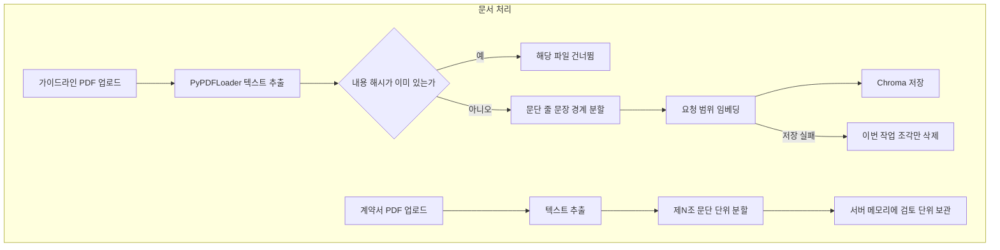
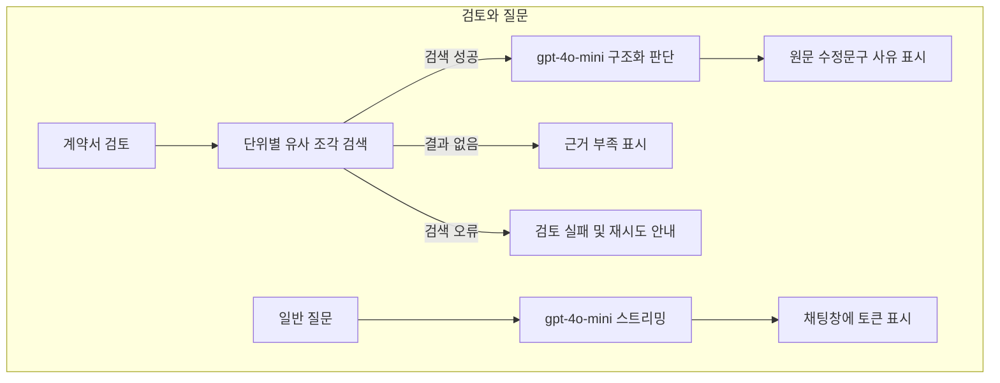

# Contract Review RAG

Flask 웹앱으로 가이드라인·약관 PDF를 RAG로 인덱싱한 뒤, 계약서 PDF를 조항·문단 단위로 나누어 OpenAI 모델로 검토합니다. 로컬 LLM은 쓰지 않으며, OpenAI API(`gpt-4o-mini`, `text-embedding-3-small`)를 호출합니다.

이 결과는 모델의 해석이며, 확정적인 법률 판단이나 법적 효력을 보장하지 않습니다.

## 1. 소개와 사용 시나리오

개인 컴퓨터에서 서버를 띄운 뒤 브라우저로 접속합니다.

1. OpenAI API 키를 화면 왼쪽 입력란에 넣습니다.
2. 가이드라인·약관 PDF를 올려 RAG 인덱스를 만듭니다. 서버를 다시 켜도 저장된 인덱스는 다시 올리지 않고 쓸 수 있습니다.
3. 검토할 계약서 PDF를 올립니다.
4. [계약서 검토]를 누르면 검토 단위별로 원문과, 이슈가 있을 때의 수정문구·사유가 표시됩니다.
5. 아래 입력란에서 일반 질문을 할 수 있습니다. 이 질문은 RAG를 쓰지 않고 모델에 바로 전달됩니다.

## 2. 구현된 주요 기능

- PDF만 업로드합니다. OCR은 없습니다.
- 가이드라인·약관: 텍스트 추출 → 문단·줄·문장 경계 우선 분할(400글자, 50글자 오버랩, 긴 줄은 글자 단위) → `text-embedding-3-small` 임베딩 → Chroma 저장
- 계약서: 텍스트 추출 → 제N조·문단을 검토 단위로 유지하고, 800글자를 넘는 조항만 추가 분할 → 서버 메모리에 보관
- 검토: 각 단위로 유사 가이드라인 조각 최대 5개를 검색합니다. 검색에 성공한 항목만 LangGraph로 위배·보완 여부를 판단합니다.
- 검색 호출이 실패하면 해당 항목은 검토 실패로 표시하고 수정문구 LLM 호출을 하지 않습니다.
- 검색 결과가 없으면 근거 부족으로 표시하며, 업로드한 가이드라인을 근거로 판단한 것처럼 쓰지 않습니다.
- 화면에 나오는 검토 항목은 `[원문]`, 이슈가 있을 때의 `[수정문구]`와 `사유`, 실패 시 `[검토 실패]`, 결과 없음일 때 `[근거 부족]`입니다. 추출된 파일명·페이지·제N조가 있으면 항목 위에 표시합니다.
- 참고 조항·페이지를 가이드라인 인용 목록으로 따로 붙이지는 않습니다. 검색된 조각의 파일명·페이지는 LLM 프롬프트에 들어갑니다. 화면에 보이는 사유는 모델이 작성한 설명입니다.
- 일반 질문은 이전 대화를 모델에 다시 보내지 않습니다. 화면에는 메시지가 남지만, 후속 질문의 맥락은 유지되지 않습니다.
- 법률·판례 검색, 위험도 점수, 대화 기록 파일 저장은 구현되어 있지 않습니다.

## 3. 기술 스택

| 구성 | 역할 |
| --- | --- |
| Flask 3.1.3 | 웹 서버, 업로드, SSE 진행 표시 |
| langchain / langchain-community / langchain-text-splitters | PDF 로딩, 문서 분할 |
| langchain-openai, openai | Chat·임베딩 API 호출 |
| langgraph | 검색 후, 성공한 항목만 분석하는 검토 흐름 |
| langchain-chroma, chromadb | 벡터 저장·유사 검색 |
| pypdf | PDF 텍스트 추출 |
| tqdm | 서버 콘솔 진행 표시 |

## 4. 처리 흐름

문서 처리와 검토·질문은 서로 다른 경로입니다.





## 5. 폴더와 파일

```
app.py                 Flask 진입점
config.py              경로·모델·분할 설정
start.bat              Windows 실행
requirements.txt       직접 의존성
templates/index.html   화면
static/css/style.css   스타일
static/js/app.js       업로드·SSE·채팅
services/rag_service.py      RAG 인덱싱·로컬 개수 조회
services/review_agent.py     계약서 분할·검토
services/text_split.py       RAG/계약서 분할
services/chat_service.py     일반 질문
services/openai_runtime.py   요청·스트림 단위 API 키
tests/                 테스트 대역 회귀 테스트
data/sample/           가상 예시 PDF
data/uploads/          실행 중 업로드 파일 로컬 저장
data/chroma_db/        실행 중 벡터 DB 로컬 저장
```

`data/uploads`와 `data/chroma_db`는 Git에 올리지 않습니다.

## 6. 내려받기와 설치

Windows, Python 3.11 기준입니다. 이 저장소를 정리할 때 사용한 버전은 3.11.9입니다.

```bat
git clone https://github.com/sngbae12/contract-review-rag.git
cd contract-review-rag
python -m venv .venv
.venv\Scripts\python -m pip install -r requirements.txt
```

가상환경 없이 전역 Python을 써도 됩니다. `start.bat`은 `.venv`가 있으면 그 Python을 먼저 사용합니다.

## 7. API 준비와 실행

로컬 모델 파일은 없습니다. [OpenAI API 키](https://platform.openai.com/api-keys)가 필요합니다.

사용 모델:

- 대화·검토: `gpt-4o-mini`
- 임베딩: `text-embedding-3-small`

키는 화면 왼쪽 입력란에 넣습니다. 기본값은 빈 칸입니다. 키는 브라우저 입력란 값과, 해당 요청 또는 SSE 스트림이 끝나는 동안의 서버 `ContextVar`에만 둡니다. 임베딩·채팅 클라이언트는 그 작업 범위에서만 만들고, 전역 벡터 저장소에 붙여 두지 않습니다. 파일, 로그, Git, URL, localStorage, sessionStorage, 쿠키에는 기록하지 않습니다. 요청이 끝나면 `ContextVar`를 되돌립니다.

외부로 나가는 데이터(코드 기준):

- RAG 인덱싱: 분할된 가이드라인 텍스트가 임베딩 API로 전송됩니다.
- 계약서 검토: 검색 쿼리(검토 단위 텍스트)가 임베딩 API로 나가고, 검색에 성공한 항목만 계약서 내용과 검색된 가이드라인 조각이 채팅 API로 전송됩니다.
- 일반 질문: 질문 문장과 고정 시스템 프롬프트가 채팅 API로 전송됩니다.

상태 조회(`/api/status`)와 저장된 조각 수 확인은 로컬 Chroma만 읽으며 OpenAI를 호출하지 않습니다.

실행:

```bat
start.bat
```

또는

```bat
.venv\Scripts\python app.py
```

접속 주소: [http://127.0.0.1:8765](http://127.0.0.1:8765)

키가 없거나 호출이 실패하면 안내 문구가 나오고 버튼은 다시 사용할 수 있습니다. 키를 고친 뒤 같은 작업을 다시 실행하면 됩니다.

## 8. 사용 방법

1. 브라우저에서 키를 입력합니다. RAG 데이터가 이미 있으면 키 입력 전에도 왼쪽 상태에 조각 수가 표시됩니다.
2. [RAG 파일 업로드]로 `data/sample/virtual_guideline.pdf` 같은 가이드라인 PDF를 올립니다. 여러 개를 한 번에 고를 수 있습니다.
3. 여러 PDF를 함께 올릴 때: 추출에 성공하고 내용이 새로운 파일만 인덱싱합니다. 추출 실패 파일은 건너뛰고 결과에 이름을 적습니다. 내용 해시가 같은 파일은 중복으로 건너뜁니다. 임베딩·저장 중 실패하면 이번 작업에서 새로 넣은 조각만 지우고, 이전에 성공한 문서는 그대로 둡니다.
4. 처리 중에도 질문 초안은 작성할 수 있습니다. 전송은 답변 생성 중에만 막힙니다.
5. [계약서 업로드]로 `data/sample/virtual_contract.pdf` 같은 계약서 PDF를 올립니다.
6. 업로드가 끝나면 [계약서 검토]가 나타납니다. 단위마다 원문이 나오고, 검색에 성공해 모델이 이슈가 있다고 판단하면 수정문구와 사유가 붙습니다. 검색 실패·근거 부족은 정상 검토나 “문제없음”으로 표시하지 않습니다.
7. 일반 질문은 입력 후 전송 버튼 또는 Enter로 보냅니다. Shift+Enter는 줄바꿈입니다. 한글 IME 조합 중 Enter는 전송하지 않도록 코드에 `isComposing`과 keyCode 229 처리가 있습니다.

같은 이름으로 계약서를 다시 올릴 때, 새 파일이 실패하면 이전에 성공한 검토 단위 목록은 그대로 둡니다. 디스크에 저장할 때는 UUID를 붙이지만, 중복 여부는 원본 PDF 바이트의 SHA-256으로 판단합니다.

## 9. 확인된 문제와 해결

- 기존 `requirements.txt`는 개발 PC의 전체 패키지 목록이라서, 앱이 직접 쓰는 패키지만 남겼습니다.
- 개발 PC에는 `chromadb==1.1.1`이 설치되어 있었으나, `langchain-chroma==1.1.0`은 `chromadb>=1.3.5`를 요구합니다. 다른 PC에서 `pip install -r requirements.txt`가 되도록 `chromadb==1.3.5`로 맞췄습니다.
- API 키를 환경변수에만 두면 다른 PC에서 바로 쓰기 어려워, 화면 입력란으로 바꿨습니다. SSE 응답은 요청이 끝난 뒤에도 이어지므로, 키는 스트림이 도는 동안 메모리에 다시 붙이도록 했습니다.
- 전역 Chroma 객체에 임베딩 클라이언트를 캐시하면 요청이 끝난 뒤에도 키가 남을 수 있어, 저장·검색 작업마다 클라이언트를 새로 만들도록 바꿨습니다.
- 상태 조회가 키 없는 최초 요청에서 조각 수 0으로 나오던 문제는, 로컬 Chroma 컬렉션을 생성하지 않고 개수만 읽도록 바꿔 해결했습니다.
- 검색 예외를 “유사 문서를 찾지 못했습니다”로 묶어 LLM 분석을 이어 가던 흐름을, 검색 성공·결과 없음·호출 실패로 나누도록 고쳤습니다.
- 배치 저장 도중 실패하면 이번 작업 ID의 조각만 지워 부분 저장·중복 적재를 막았습니다.
- 분할 구분자가 줄바꿈뿐이면 긴 한 줄이 설정값보다 큰 채로 남았습니다. 마지막 구분자를 빈 문자열로 두어 글자 단위 분할이 되게 했습니다.
- RAG 30글자·계약서 30글자는 조항 의미가 자주 끊겼습니다. RAG는 검색용 400글자(오버랩 50), 계약서는 제N조·문단 유지 후 800글자 초과만 자르도록 바꿨습니다.
- 파일명과 서버 메시지를 `innerHTML`에 넣던 경로는 `textContent`와 고정된 진행 UI로 분리했습니다.
- SSE가 `done`/`error` 없이 끝나도 정상 반환하던 문제는 중단 오류로 처리하도록 바꿨습니다.
- 13MB짜리 기존 샘플 PDF는 이미지 비중이 커서 Git에 넣지 않았습니다. 가상 텍스트 PDF를 `data/sample/virtual_*.pdf`로 추가했습니다.

## 10. 성능, 한계, 향후 개선

측정하지 않은 응답 시간·정확도는 적지 않습니다.

한계:

- 텍스트가 있는 PDF만 처리합니다. 스캔본 OCR은 없습니다.
- 검토 단위는 문장 자동 인식이 아니라 제N조·문단과 길이 제한입니다.
- 가이드라인 근거를 화면에서 조항 인용 목록으로 보여 주지는 않습니다. 계약서 단위의 파일명·페이지·제N조는 추출된 값이 있을 때만 표시합니다.
- 일반 질문은 대화 맥락을 이어 가지 않습니다.
- 업로드 파일과 벡터 DB는 이 컴퓨터의 로컬 폴더에 남습니다. 계약서 검토 단위는 서버 프로세스 메모리에 있어 서버를 끄면 사라집니다. 채팅 내용은 브라우저 화면에만 있고 서버 파일로는 저장하지 않습니다.
- 모델 출력은 참고용입니다.

향후 개선 후보(아직 구현하지 않음): 대화 맥락 유지, 가이드라인 조항 인용 표시, OCR, 검토 결과 파일 내보내기.

## 11. 검증 결과와 미검증 항목

별도 가상환경 `.venv-verify`(Python 3.11.9)에서 `pip install -r requirements.txt`와 `pip check`를 이전에 수행했습니다. 이번 수정 후 테스트는 `python -m unittest discover -s tests -v`로 실행했습니다.

테스트 대역 검증(실제 OpenAI 호출 없음):

- 정상 샘플 PDF 분할, 손상된 PDF 업로드 후 기존 계약서 유지
- 로컬 Chroma를 만든 뒤 API 키 없이 `/api/status`에서 조각 수 복구, 빈 경로에서는 컬렉션 미생성
- 검색 예외 시 LLM 미호출·검토 실패 표시, 검색 결과 없음과 구분
- RAG 저장 중간 실패 후 이번 작업 조각 삭제 및 기존 문서 유지
- 동일 PDF 내용 재업로드 시 중복 건너뜀
- 파일명을 `textContent`로 넣는 코드 경로, SSE 정상 완료·명시적 오류·중간 종료 파서
- 키 없이 RAG·검토·질문 요청 시 400
- 소스에 Enter / Shift+Enter / 한글 IME(`isComposing`, keyCode 229) 처리가 있는지 확인

실제 OpenAI 호출: 이번 수정 작업에서는 호출량을 위해 다시 돌리지 않았습니다. 미검증입니다.

브라우저에서 직접 확인하지 못한 항목:

- 전송 버튼·Enter·Shift+Enter·한글 IME 조합의 실제 입력
- 처리 중 질문 초안 작성 UI
- 버튼이 화면에서 영구적으로 잠기는지(코드상 `finally`에서 해제)

응답 시간과 정확도 수치는 측정하지 않았습니다.

라이선스 파일은 코드와 모델 이용 조건을 이 작업에서 확인하지 않아 넣지 않았습니다.
