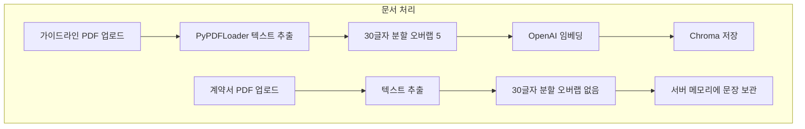
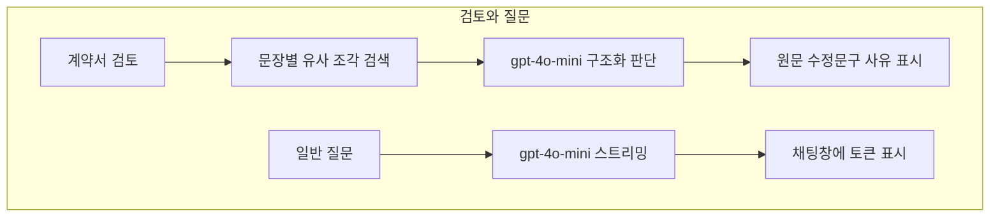

# Contract Review RAG

Flask 웹앱으로 가이드라인·약관 PDF를 RAG로 인덱싱한 뒤, 계약서 PDF를 문장 단위로 나누어 OpenAI 모델로 검토합니다. 로컬 LLM은 쓰지 않으며, OpenAI API(`gpt-4o-mini`, `text-embedding-3-small`)를 호출합니다.

이 결과는 모델의 해석이며, 확정적인 법률 판단이나 법적 효력을 보장하지 않습니다.

## 1. 소개와 사용 시나리오

개인 컴퓨터에서 서버를 띄운 뒤 브라우저로 접속합니다.

1. OpenAI API 키를 화면 왼쪽 입력란에 넣습니다.
2. 가이드라인·약관 PDF를 올려 RAG 인덱스를 만듭니다.
3. 검토할 계약서 PDF를 올립니다.
4. [계약서 검토]를 누르면 문장별로 원문·수정문구·사유가 표시됩니다.
5. 아래 입력란에서 일반 질문을 할 수 있습니다. 이 질문은 RAG를 쓰지 않고 모델에 바로 전달됩니다.

## 2. 구현된 주요 기능

- PDF만 업로드합니다. OCR은 없습니다.
- 가이드라인·약관: 텍스트 추출 → 30글자 분할(5글자 오버랩) → `text-embedding-3-small` 임베딩 → Chroma 저장
- 계약서: 텍스트 추출 → 30글자 분할(오버랩 없음) → 메모리에 문장 목록 보관
- 검토: 각 문장으로 유사 가이드라인 조각 5개를 검색한 뒤 LangGraph로 위배·보완 여부를 판단합니다.
- 화면에 나오는 검토 항목은 `[원문]`, 이슈가 있을 때의 `[수정문구]`, `사유`입니다.
- 참고 조항·페이지 번호는 화면에 따로 붙이지 않습니다. 검색된 조각의 파일명은 LLM 프롬프트에만 들어갑니다. 화면에 보이는 사유는 모델이 작성한 설명입니다.
- 일반 질문은 이전 대화를 모델에 다시 보내지 않습니다. 화면에는 메시지가 남지만, 후속 질문의 맥락은 유지되지 않습니다.
- 법률·판례 검색, 위험도 점수, 대화 기록 파일 저장은 구현되어 있지 않습니다.

## 3. 기술 스택

| 구성 | 역할 |
| --- | --- |
| Flask 3.1.3 | 웹 서버, 업로드, SSE 진행 표시 |
| langchain / langchain-community / langchain-text-splitters | PDF 로딩, 문서 분할 |
| langchain-openai, openai | Chat·임베딩 API 호출 |
| langgraph | 검색 → 분석 검토 흐름 |
| langchain-chroma, chromadb | 벡터 저장·유사 검색 |
| pypdf | PDF 텍스트 추출 |
| tqdm | 서버 콘솔 진행 표시 |

## 4. 처리 흐름

문서 처리와 검토·질문은 서로 다른 경로입니다.





## 5. 폴더와 파일

```
app.py                 Flask 진입점
config.py              경로·모델·분할 설정
start.bat              Windows 실행
requirements.txt       직접 의존성
templates/index.html   화면
static/css/style.css   스타일
static/js/app.js       업로드·SSE·채팅
services/rag_service.py      RAG 인덱싱
services/review_agent.py     계약서 분할·검토
services/chat_service.py     일반 질문
services/openai_runtime.py   요청 단위 API 키
data/sample/           가상 예시 PDF
data/uploads/          실행 중 업로드 파일 로컬 저장
data/chroma_db/        실행 중 벡터 DB 로컬 저장
```

`data/uploads`와 `data/chroma_db`는 Git에 올리지 않습니다.

## 6. 내려받기와 설치

Windows, Python 3.11 기준입니다. 이 저장소를 정리할 때 사용한 버전은 3.11.9입니다.

```bat
git clone https://github.com/sngbae12/contract-review-rag.git
cd contract-review-rag
python -m venv .venv
.venv\Scripts\python -m pip install -r requirements.txt
```

가상환경 없이 전역 Python을 써도 됩니다. `start.bat`은 `.venv`가 있으면 그 Python을 먼저 사용합니다.

## 7. API 준비와 실행

로컬 모델 파일은 없습니다. [OpenAI API 키](https://platform.openai.com/api-keys)가 필요합니다.

사용 모델:

- 대화·검토: `gpt-4o-mini`
- 임베딩: `text-embedding-3-small`

키는 화면 왼쪽 입력란에 넣습니다. 기본값은 빈 칸입니다. 서버는 요청을 처리하는 동안 메모리에서만 쓰고, 파일·로그·Git·URL·브라우저 저장소에는 기록하지 않습니다.

외부로 나가는 데이터(코드 기준):

- RAG 인덱싱: 분할된 가이드라인 텍스트가 임베딩 API로 전송됩니다.
- 계약서 검토: 계약서 문장과 검색된 가이드라인 조각이 채팅 API로 전송됩니다.
- 일반 질문: 질문 문장과 고정 시스템 프롬프트가 채팅 API로 전송됩니다.

실행:

```bat
start.bat
```

또는

```bat
.venv\Scripts\python app.py
```

접속 주소: [http://127.0.0.1:8765](http://127.0.0.1:8765)

키가 없거나 호출이 실패하면 안내 문구가 나오고 버튼은 다시 사용할 수 있습니다. 키를 고친 뒤 같은 작업을 다시 실행하면 됩니다.

## 8. 사용 방법

1. 브라우저에서 키를 입력합니다.
2. [RAG 파일 업로드]로 `data/sample/virtual_guideline.pdf` 같은 가이드라인 PDF를 올립니다. 여러 개를 한 번에 고를 수 있습니다.
3. 처리 중에도 질문 초안은 작성할 수 있습니다. 전송은 답변 생성 중에만 막힙니다.
4. [계약서 업로드]로 `data/sample/virtual_contract.pdf` 같은 계약서 PDF를 올립니다.
5. 업로드가 끝나면 [계약서 검토]가 나타납니다. 문장마다 원문이 나오고, 모델이 이슈가 있다고 판단하면 수정문구와 사유가 붙습니다.
6. 일반 질문은 입력 후 전송 버튼 또는 Enter로 보냅니다. Shift+Enter는 줄바꿈입니다. 한글 IME 조합 중 Enter는 전송하지 않습니다.

같은 이름으로 계약서를 다시 올릴 때, 새 파일이 실패하면 이전에 성공한 문장 목록은 그대로 둡니다. RAG는 기존 Chroma 컬렉션에 조각을 추가합니다. 실패하면 이번 배치 이전 데이터는 유지합니다.

## 9. 확인된 문제와 해결

- 기존 `requirements.txt`는 개발 PC의 전체 패키지 목록이라서, 앱이 직접 쓰는 패키지만 남겼습니다.
- 개발 PC에는 `chromadb==1.1.1`이 설치되어 있었으나, `langchain-chroma==1.1.0`은 `chromadb>=1.3.5`를 요구합니다. 다른 PC에서 `pip install -r requirements.txt`가 되도록 `chromadb==1.3.5`로 맞췄습니다.
- API 키를 환경변수에만 두면 다른 PC에서 바로 쓰기 어려워, 화면 입력란으로 바꿨습니다. SSE 응답은 요청이 끝난 뒤에도 이어지므로, 키는 스트림이 도는 동안 메모리에 다시 붙이도록 했습니다.
- 13MB짜리 기존 샘플 PDF는 이미지 비중이 커서 Git에 넣지 않았습니다. 가상 텍스트 PDF를 `data/sample/virtual_*.pdf`로 추가했습니다.

## 10. 성능, 한계, 향후 개선

측정하지 않은 응답 시간·정확도는 적지 않습니다.

한계:

- 텍스트가 있는 PDF만 처리합니다. 스캔본 OCR은 없습니다.
- 검토 단위는 문장이 아니라 30글자 조각입니다.
- 근거 조항·페이지를 화면 인용으로 보여 주지 않습니다.
- 일반 질문은 대화 맥락을 이어 가지 않습니다.
- 업로드 파일과 벡터 DB, 계약서 문장은 이 컴퓨터의 앱 프로세스/로컬 폴더에 남습니다. 채팅 내용은 브라우저 화면에만 있고 서버 파일로는 저장하지 않습니다.
- 모델 출력은 참고용입니다.

향후 개선 후보(아직 구현하지 않음): 대화 맥락 유지, 페이지·조항 인용 표시, OCR, 검토 결과 파일 내보내기.

## 11. 검증 결과와 미검증 항목

별도 가상환경 `.venv-verify`(Python 3.11.9)에서 `pip install -r requirements.txt`와 `pip check`를 수행했습니다. 깨진 의존성은 없었습니다.

테스트 대역이 아니라 Flask 테스트 클라이언트와 실제 OpenAI 호출을 구분해 확인했습니다.

로직 검증(API 키 없이 또는 가짜 파일):

- 서버 페이지 `/`, `/api/status` 응답
- 키 없이 RAG·검토·질문 요청 시 400과 재시도 안내
- PDF가 아닌 파일 거부
- 가상 계약서 PDF 업로드·문장 분할 5개
- 처리 실패 PDF 이후에도 이전 계약서 상태 유지
- API 키 입력란이 비어 있음

실제 LLM·벡터 DB 검증(요청 헤더로 키 전달, 키는 파일에 저장하지 않음):

- 가상 가이드라인 임베딩·Chroma 저장(6조각)
- 계약서 문장 5개 검토 완료, 원문·사유 필드 존재
- 일반 질문 토큰 스트리밍 완료
- 잘못된 키 오류 후 올바른 키로 재시도 성공

브라우저에서 직접 확인하지 못한 항목:

- 전송 버튼·Enter·Shift+Enter·한글 IME 조합
- 처리 중 질문 초안 작성 UI
- 버튼이 화면에서 영구적으로 잠기는지(코드상 `finally`에서 해제)

응답 시간과 정확도 수치는 측정하지 않았습니다.

라이선스 파일은 코드와 모델 이용 조건을 이 작업에서 확인하지 않아 넣지 않았습니다.
